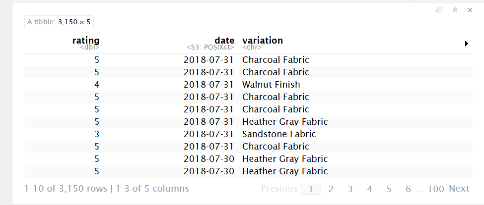

```{r setup, include=FALSE}
knitr::opts_chunk$set(echo = TRUE)
```


Using Loop Function

for() loop

1. Using the for loop, create an R script that will display a 5x5 matrix as shown in
Figure 1. It must contain vectorA = [1,2,3,4,5] and a 5 x 5 zero matrix.
Hint Use abs() function to get the absolute value

```{r}
vectorA <- c(1, 2, 3, 4, 5)
zero_matrix <- matrix(0, nrow = 5, ncol = 5)

for (i in 1:5) {
  for (j in 1:5) {
  zero_matrix[i, j] <- abs(vectorA[i] - vectorA[j])
  } 
}
print(zero_matrix)

```
2. Print the string "*" using for() function. The output should be the same as shown
in Figure

```{r}
for (i in 1:5) {
  cat(rep('"*"', i), "\n")
}

```
3. Get an input from the user to print the Fibonacci sequence starting from the 1st input
up to 500. Use repeat and break statements. Write the R Scripts and its output.

```{r}
x <- 0
y <- 1

num <- readline(prompt = "Enter the starting number: ")
3
repeat {
  num <- x + y
  if (num > 500) break
  x <- y
  y <- num
  print(num)
}

```

Using Basic Graphics (plot(),barplot(),pie(),hist())

4. Import the dataset as shown in Figure 1 you have created previously.

a. What is the R script for importing an excel or a csv file? Display the first 6 rows of
the dataset? Show your codes and its result
```{r}
library(readxl)
data_table <- read_excel("/cloud/project/Worksheet#4/data_table.xlsx")
print(head(data_table))
```
b. Create a subset for gender(female and male). How many observations are there in
Male? How about in Female? Write the R scripts and its output.
```{r}
males <- subset(data_table)
females <- subset(data_table)

n_males <- nrow(males)
n_females <- nrow(females)

cat("Number of Male observations: ", n_males, "\n")
cat("Number of Female observations: ", n_females, "\n")
```
c. Create a graph for the number of males and females for Household Data. Use plot(), chart type = barplot. Make sure to place title, legends, and colors. Write the R scripts and its result.

```{r}
library(ggplot2)

  
  Gender = c("Male", "Female")
  Number = c(28, 28)       
  data_table <- data.frame(Gender, Number)

ggplot(data_table, aes(x = Gender, y = Number, fill = Gender)) +
  geom_bar(stat = "identity") +
  theme(legend.title = element_blank())

```


5. The monthly income of Dela Cruz family was spent on the following:
Food Electricity Savings Miscellaneous
60    10            5         25

a. Create a piechart that will include labels in percentage.Add some colors and title of
the chart. Write the R scripts and show its output.

```{r}
library(ggplot2) 

   bills <- c(60, 10, 5, 25)
   categories <- c("Food", "Electricity", "Savings", "Miscellaneous")

   percentages <- round(bills / sum(bills) * 100, 1)
   labels <- paste(categories, percentages, "%")

pie(
  bills,
  main = "Dela Cruz Family Monthly Income",
  col = c("lightblue", "lightyellow", "gold", "brown"),
  labels = labels,
)

```


6. Use the iris dataset.
data(iris)

a. Check for the structure of the dataset using the str() function. 

- Describe what you have seen in the output.

- Based on my observations, the iris data set is a data frame that has 5 variables and 150 obs. The following variables are Sepal.Length, Sepal.Width, Petal.Length, Petal.Width, and Species with 3 Factor Levels5

```{r}
data(iris)
str(iris)
```

b. Create an R object that will contain the mean of the sepal.length,
sepal.width,petal.length,and petal.width. What is the R script and its result?

```{r}
data(iris)
value <- colMeans(iris[, 1:4])
print(value)

```

c. Create a pie chart for the Species distribution. Add title, legends, and colors. Write
the R script and its result.

```{r}
data(iris)

species_data <- table(iris$Species)

labels <- paste(names(species_data), species_data, sep = " (")
labels <- paste(labels, ")", sep = "")

pie(
  species_data,
  labels = labels,
  col = c("pink", "purple", "lightblue"),
  main = "Species Distribution"
)
```


d. Subset the species into setosa, versicolor, and virginica. Write the R scripts
and show the last six (6) rows of each species.

```{r}

setosa_sub <- subset(iris, Species == "setosa")
versicolor_sub <- subset(iris, Species == "versicolor")
virginica_sub <- subset(iris, Species == "virginica")

print(tail(setosa_sub))
print(tail(versicolor_sub))
print(tail(virginica_sub))

```


e. Create a scatterplot of the sepal.length and sepal.width using the different
species(setosa,versicolor,virginica). Add a title = “Iris Dataset”, subtitle = “Sepal
width and length, labels for the x and y axis, the pch symbol and colors should be based on
the species.

```{r}
library(ggplot2)
data(iris)

iris$Species <- as.factor(iris$Species)

scatter_plot <- ggplot(iris, aes(x = Sepal.Length, y = Sepal.Width, color = Species, shape = Species)) +
  ggtitle("Iris Dataset") + 
  labs(subtitle = "Sepal Width and Length", x = "Sepal Length", y = "Sepal Width") + 
  geom_point(size = 3) + 
  scale_color_manual(values = c("setosa" = "pink", "versicolor" = "purple", "virginica" = "lightblue")) + 
  scale_shape_manual(values = c(16, 17, 18))


print(scatter_plot)
```

Hint: Need to convert to factors the species to store categorical variables.


f. Interpret the result.

- The results show the Sepal Width and Length of each species, The setosa has the most width than length , the versicolor has more length than width, and the virginica has the most length than width


Basic Cleaning and Transformation of Objects

7. Import the alexa-file.xlsx. Check on the variations. Notice that there are extra whitespaces among black variants (Black Dot, Black Plus, Black Show, Black Spot). Also on the white variants (White Dot, White Plus, White Show, White Spot).

```{r}
library(readxl)
alexa <- read_excel("/cloud/project/Worksheet#4/alexa_file.xlsx")
print(alexa)
```
a. Rename the white and black variants by using gsub() function.

Syntax:

RObject$columnName <- gsub("Old Name", "New Name", RObject$columnName)

Write the R scripts and show an example of the output by getting a snippet. To embed
an image into Rmd, use the function below:
# knitr::include_graphics("file path")

```{r}
variation <- gsub("Black Dot", "BlackDot", alexa$variation)
variation <- gsub("Black Plus", "BlackPlus", alexa$variation)
variation <- gsub("Black Show", "BlackShow", alexa$variation)
variation <- gsub("Black Spot", "BlackSpot", alexa$variation)

variation <- gsub("White Dot", "WhiteDot", alexa$variation)
variation <- gsub("White Plus", "WhitePlus", alexa$variation)
variation <- gsub("White Show", "WhiteShow", alexa$variation)
variation <- gsub("White Spot", "WhiteSpot", alexa$variation)

print(alexa)
```

```{r}


```
b. Get the total number of each variations and save it into another object. Save the
object as variations.RData. Write the R scripts. What is its result?

Hint: Use the dplyr package. Make sure to install it before loading the package.

Syntax for dplyr

RObject %>%
count(RObject$columnName)

```{r}
library(dplyr)

variations <- alexa %>%
  count(variation)

save(variations, file = "/cloud/project/Worksheet#4/variations.RData")
load("/cloud/project/Worksheet#4/variations.RData")

print(variations)
```

Sample Output

c. From the variations.RData, create a barplot(). Complete the details of the chart which include the title, color, labels of each bar.

```{r}
load("variations.RData")
library(kableExtra)

variation_counts <- setNames(variations$n, variations$variation)

load("variations.RData")

variations_data <- data.frame(variations)

kable(variations_data, col.names = c("Variation", "Total"), 
      align = c("l", "c"))

```

```{r}
barplot(
  variation_counts,                     
  main = "Count of Each Variation",      
  col = "pink",                     
  xlab = "Variation",                   
  ylab = "Count",                       
  las = 2,                             
  names.arg = variations$variation       
)
```

d. Create a barplot() for the black and white variations. Plot it in 1 frame, side by
side. Complete the details of the chart.

```{r}
library(ggplot2)
library(gridExtra)

black_var <- data.frame(
  variation = c("Black", "Black Plus", "Black Show", "Black Spot", "Black Dot"),
  Count = c(250, 300, 200, 100, 500)
)

white_var <- data.frame(
  variation = c("White", "White Dot", "White Plus", "White Show", "White Spot"),
  Count = c(100, 150, 80, 90, 120)
)

plot_black <- ggplot(black_var, aes(x = variation, y = Count, fill = variation)) +
  geom_bar(stat = "identity") +
  labs(title = "Black Variants", y = "Variants", x = "Total Numbers") +
  theme_minimal() +
  theme(
    legend.position = "none",
    axis.text.y = element_text(size = 8)
  )
```
```{r}
library(ggplot2)
library(gridExtra)

plot_white <- ggplot(white_var, aes(x = variation, y = Count, fill = variation)) +
  geom_bar(stat = "identity") +
  labs(title = "White Variants", y = "Variants", x = "Total Numbers") +
  theme_minimal() +
  theme(
    legend.position = "none",
    axis.text.y = element_text(size = 8)
  )

plot_black <- ggplot(black_var, aes(x = variation, y = Count, fill = variation)) +
  geom_bar(stat = "identity") +
  labs(title = "Black Variants", y = "Variants", x = "Total Numbers") +
  theme_minimal() +
  theme(
    legend.position = "none",
    axis.text.y = element_text(size = 8)
  )

grid.arrange(plot_black, plot_white, ncol = 2)
```

